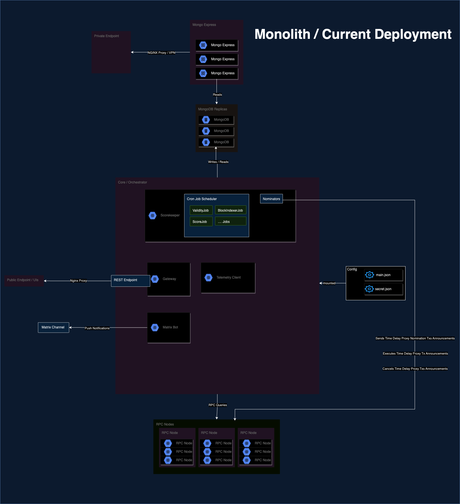
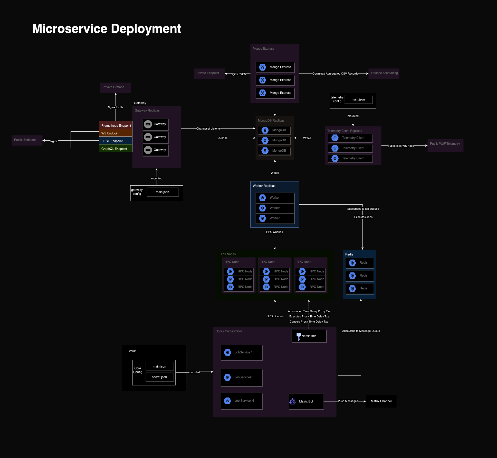

import { ProgrammeName } from '../../components/ProgrammeName';


:::info <ProgrammeName/> Backend

A monorepo containing TypeScript microservices for the <ProgrammeName/>.

:::

# Overview

> A monorepo containing TypeScript microservices

The monorepo is managed using Yarn workspaces, and contains the following packages:
- [`packages/common`](packages/common): A package containing common code shared across all microservices.
- [`packages/core`](packages/core): A package containing the core logic of the Thousand Validators Program.
- [`packages/gateway`](packages/gateway): A package for an API gateway that exposes the backend with a REST API.
- [`packages/telemetry`](packages/telemetry): A package for a telemetry client that monitors uptime
- [`packages/worker`](packages/worker): A packages for job queue workers that perform background tasks.


## Installation & Setup

### Instances

There's a few ways of running the backend with docker containers, either in kubernetes, or with docker-compose.

There is the `Current / Monolith` way of running instances, and the `Microservice` way of running instances.

`Current / Monolith` Architecture:




`Microservice` Architecture:



The following are different ways of running in either `Current` or `Microservice` architecture with either `Kusama` or `Polkadot`, and either `Development` or `Production`:

- `Kusama Current`
  - Running as a monolith with production values
- `Polkadot Current`
  - Running as a monolith with production values
- `Kusama Microservice`
  - Running as microservices with production values
- `Polkadot Microservice`
  - Running as microservices with production values
- `Polkadot Current Dev`
  - Running as a monolith with development values
- `Kusama Current Dev`
  - Running as a monolith with development values
- `Kusama Microservice Dev`
  - Running as microservices with development values
- `Polkadot Microservice Dev`
  - Running as microservices with development values

Each package contains a `Dockerfile`, which is used for running in production,  and `Dockerfile-dev`, which is used for development. The development images will use run with `nodemon` so that each time files is saved/changed it will rebuild the image and restart the container. Any changes for the regular run `Dockerfile` will need a manual rebuilding of the docker image.

The difference of running as either `Current` or `Microservice` is in which docker containers get run with `docker-compose` (Microservices have services separated out as their own containers, and additionally rely on Redis for messages queues). Outside of this everything else (whether it's run as a Kusama or Polkadot instance) is determined by the JSON configuration files that get generated.

### Cloning the Repository
```bash
git clone https://github.com/w3f/1k-validators-be.git
cd 1k-validators-be
```

### Installing System Dependencies

Ensure the following are installed on your machine:
- [Node.js](https://nodejs.org/en/) (v12 or higher)
- [Yarn](https://yarnpkg.com/) (v1.22 or higher)
- [Docker](https://www.docker.com/) (v19 or higher)


### Yarn Installation & Docker Scripts (All in One)

The following are scripts that can be run with `yarn` that will run all the required installations, config generations and build and run the docker containers. If these are not used you will need to do each separately in the following sections.
First run:

`yarn install`
Kusama Current / Monolith Production:

```bash
yarn docker:kusama-current:start
```

Kusama Current / Monolith Dev:

```bash
yarn docker:kusama-current-dev:start
```

Polkadot Current / Monolith Production:

```bash
yarn docker:polkadot-current:start
```

Polkadot Current / Monolith Dev:

```bash
yarn docker:polkadot-current-dev:start
```

Kusama Microservice Production:

```bash
yarn docker:kusama-microscervice:start
```

Kusama Microservice Dev:

```bash
yarn docker:kusama-microservice-dev:start
```

Polkadot Microservice Production:

```bash
yarn docker:polkadot-current:start
```

Polkadot Microservice Dev:

```bash
yarn docker:polkadot-current-dev:start
```

### Install Yarn Dependencies
```bash
yarn install
```

### Building Node Packages
```bash
yarn build
```

### Creating Configuration Files
Before running the microservices with `docker-compose`, you must create configuration files for each service to be run.

Kusama Current Config:
This will create a configuration file for a Kusama instance that mirrors what is currently deployed. This runs the `core` service within one container, and includes the `gateway` and `telemetry` client, all run in the same node.js process.
```bash
yarn create-config-kusama-current
```

Polkadot Current Config:
This will create a configuration file for a Kusama instance that mirrors what is currently deployed. This runs the `core` service within one container, and includes the `gateway` and `telemetry` client, all run in the same node.js process.
```bash
yarn create-config-polkadot-current
```

Kusama Microservice Config:
This will create configuration files for a Kusama instance for each microservice that runs with production values. This runs `core`, `gateway`, `telemetry`, and `worker` as separate processes in their own container - each one needs it's own configuration file.
```bash
yarn create-config-kusama-microservice
```

Polkadot Microservice Config:
This will create configuration files for a Polkadot instance for each microservice that runs with production values. This runs `core`, `gateway`, `telemetry`, and `worker` as separate processes in their own container - each one needs it's own configuration file.
```bash
yarn create-config-polkadot-microservice
```


### Running the Microservices

#### Running `Kusama Current` or `Polkadot Current`:

Either is from the same `docker-compose.current.yml` file, and runs only the `core` container, `mongo` container, and `mongo-express` container.

Build and run as detached daemon:
```bash
docker compose -f docker-compose.current.yml up -d --build
```

#### Running `Kusama Microservice` or `Polkadot Microservice`:

Either is from the same `docker-compose.microservice.yml` file. This runs `core`, `gateway`, `telemetry`, and `worker` as separate processes in their own container - each one needs it's own configuration file. It additionally runs a `redis`, `mongo`, and `mongo-express` container.

Build and run as detached daemon:
```bash
docker compose -f docker-compose.microservice.yml up -d --build
```

#### Running `Kusama Current Dev`, `Polkadot Current Dev`, `Kusama Microservice Dev`, or `Polkadot Microservice Dev`

Either is from the same `docker-compose.yml` file.

Build and run as detached daemon:
```bash
docker compose -f docker-compose.yml up -d --build
```


### Viewing Logs

To view the aggregated logs of all the containers:

```bash
yarn docker:logs
```

or

```bash
docker compose logs -f       
```

To view the logs of an individual service:

Core:
```bash
yarn docker:logs:core
```
or
```bash
docker logs 1k-validators-be-1kv-core-1 -f
````

Gateway:
```bash
yarn docker:logs:gateway
```

or

```bash
docker logs 1k-validators-be-1kv-gateway-1 -f   
```

Telemetry:
```bash
yarn docker:logs:telemetry
```

or

```bash
docker logs 1k-validators-be-1kv-telemetry-1 -f  
```

Worker:

```bash
yarn docker:logs:worker
```

or

```bash
docker logs 1k-validators-be-1kv-worker-1 -f  
```

### Stopping Containers

To stop all containers:

```bash
yarn docker:stop
```

or

```bash
docker-compose down
```

#### Express REST API

When running as a monolith, the Express REST API is exposed on port `3300`. When running as microservices, the Express REST API is exposed on port `3301`.

You can then query an endpoint like `/candidates` by going to `http://localhost:3300/candidates` or `http://localhost:3301/candidates` in your browser.

#### Mongo Express (Database GUI)

To view the Mongo Express GUI to interact with the MongoDB Database, go to `http://localhost:8888/` in your browser. Or run `yarn open:mongo-express` from the root directory.

#### BullMQ Board (Job Queue GUI)

To view the BullMQ Board GUI to interact with the Job Queue, go to `http://localhost:3301/bull` in your browser if running as microservices. Or run `yarn open:bull` from the root directory.
